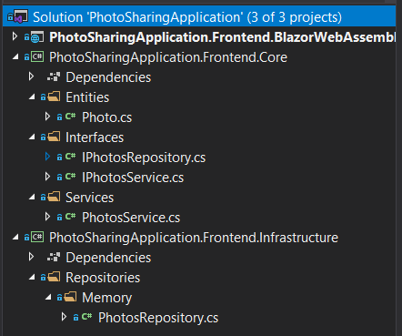

# Lab 2: upload photo page

Create a page to upload a photo with a bit of form validation. Apply a [Clean-ish Architecture](https://blog.cleancoder.com/uncle-bob/2012/08/13/the-clean-architecture.html) by creating:



* An `Frontend.Infrastructure` class library project that knows how to actually read/persist data with repositories. For this exercise, add the first repository: one that simply defines the data as a hard-coded list
  * In future exercises, we will be adding repos that use REST and gRPC as well
* A `Frontend.Core` class library project that contains business logic:
  * Entities (models)
  * Business logic in the form of `Services` that do some sort of validation before passing it on to the infrastructure
  * Interfaces for the services and repositories

Let the All Photos page use these architectural elements as well.

## A bit of help

**Uploading the photo**

For reading out the photo image bytes, this code might help:

```html
<InputFile OnChange="HandleFileSelected" />
```
```cs
Photo photo; // @bind- to this

private async Task HandleFileSelected(InputFileChangeEventArgs args) {
	photo.ImageMimeType = args.File.ContentType;

	using (var streamReader = new MemoryStream()) {
		await args.File.OpenReadStream().CopyToAsync(streamReader);
		photo.PhotoFile = streamReader.ToArray();
	}
}
```

**Showing the photo**

For displaying the base64-bytes of the photo, something like this ought to help:
```html

```
